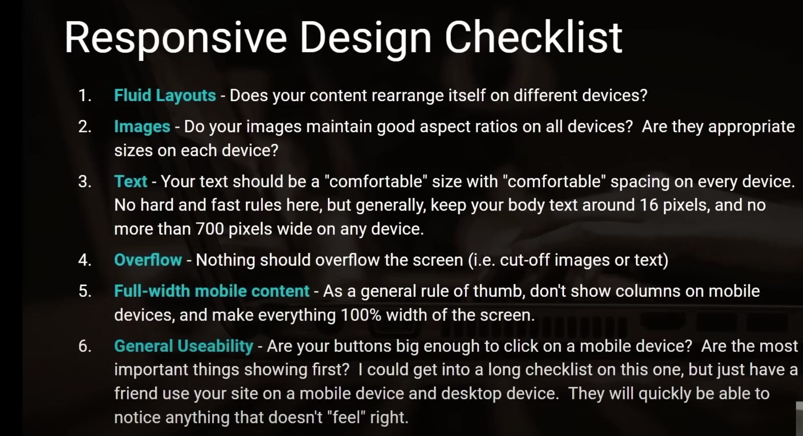
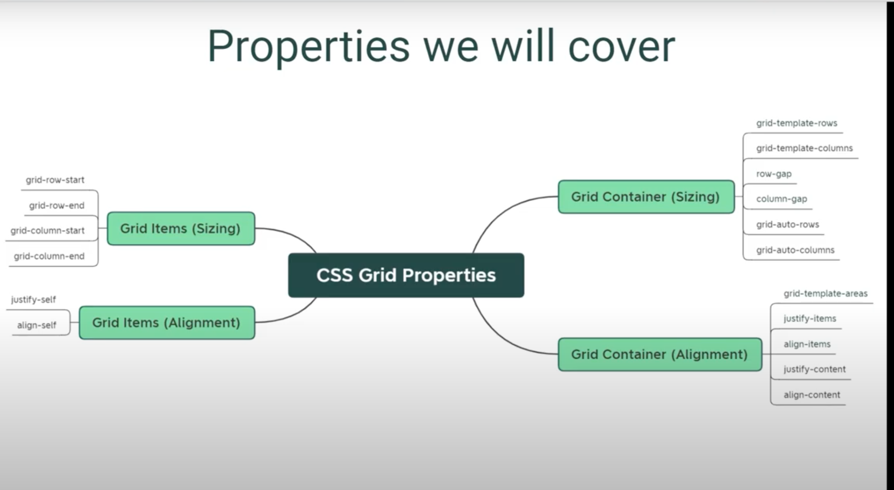
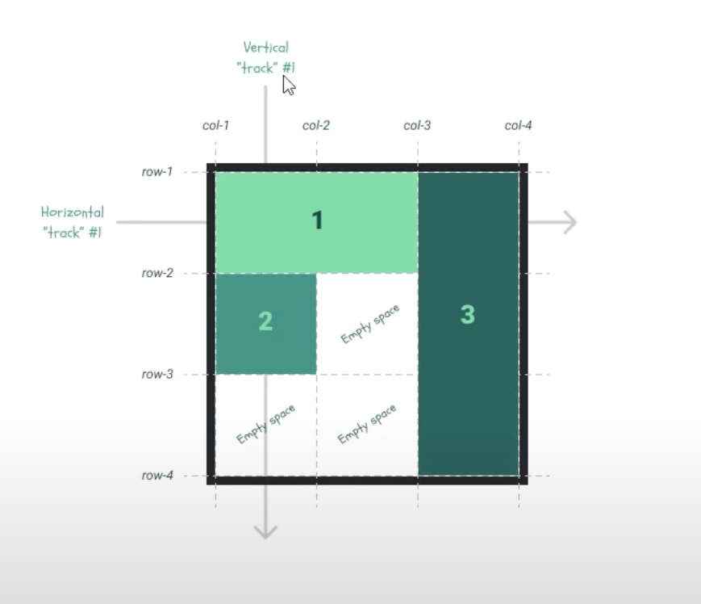
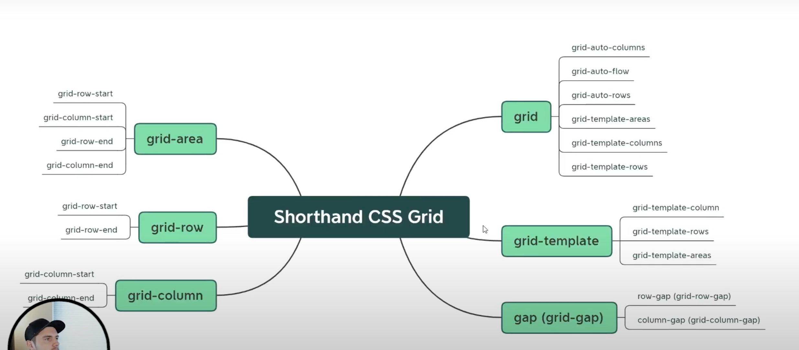

## Css

# ref mdn docs, frontend mentor, code pen

Descendence selector
.mainclass li {
This mainclass is the preselector and li is the selector, the one with the right is always the actual elem we wana style
}
Child selector
.mainclass > p {} --> will only target the child

sibbling selector
ul ~ p {} will look for all the ul and the direct sibling (para) and style em

if diff tags shares the same class name and we wwana style only one then
p[class = "mainclass"]{} now this will apply only to the para, its kinda of and op

in the end.. tag, class, and id are totally sufficient for styling .

common prop:
if we wana give the same props vals b/w 2 class then we can separate em by comma
.main1, .main2 {} this will avoid dry -- shared styles

or we can also provide diff class names and also give same class name for the shared props

 this space b/w em is considered as the diff class 
.shared{}

# pseudo class

we can use this to btn and based on the state the pseudo class will styled differenty, such as hovering
button:hover {} target the elem and in hover state apply styling

the concept of cascading is put all the style sheets together and the one with the more precedence win the rule and the remaining rule will not apply or strike out, this happens when we ve our local style sheet and the external style sheet come together.

there are 2 factors for determing the precedent of the css

1. location of the css file -- since the css reads from top to bottom the recent one wins
2. the specificity of the css rule -- mostly the id prop wins, despite of its position/ location...least-tags , 2nd least classes, most- ids
3. mostly it will counts for the no.of id selectors and class selectors and then finally the no. of tag selectors .. this is the math
4. Then the inline styles takes the precedence over anything else
   

5. finally the important kw will take more precedence, we can use this only if we wana overide the predefined css
   p {
   color : orage !important;
   }

## box model

the main display prop are block, inline block, flex, and grid

- the default type of most of the elem is block
- unlike block elem, the inline elems only occupy the content of the div, and it does not respect the height and width
- but the inline block elem will respect the height and width props

box

- the default type of box is content box
- the border box we don't ve to calculate all the width or heighe we can just give the h and w valus -- if we add padding or border to the elem it ensures that the final width wont be change if we add 200px the padding and border 10 each and the final elem will still be 200 not included the padding and border
  box-sizing : border-box;
- this box ssizing is very imp when we working with the grids, how much size we can give to the child elems to fit within the parent container etc..
- - -- is wildcard char basically saying we wana target every elem in the doc

  * the box model describes how much space an html elems occupy
  * the space is heavily influenced by the box sizing prop
  * the space nd layout is heavily influenced by the display prop
  * all the other css props are supplementry to the box model concept

# position prop

this position prop are very handy when working with nav bar

position : fixed or static or sticky or absolute or relative;
width : 100 vw - view port width, and vh viewport height

- finally if we set relative position to the parent elem, then we can set absolute position to the child elems. if it don't ve relative positioin to the parent then it will position itself relative to the view port

## css measurement units

1. REM (font units) - if we set the font-size : 1rem; means its gon be 100% to the relative of the root elems font size - html{font-size : 16px;}, means 100% to the 16px which is 16px
2. Em (font units) - its almost as same as rem instead its relative to parent elem not to the root elem
3. pixel
4. percentage (for responsive designs) - instead of placing px for the width or height which can shrink as the display size changes, we can make % for them so they can stay as per the display changes ex - height :80% insted of 600px
   - the percentages are relative to their container not relative to their entire web pages

# custom fonts

when we re dealing with fonts there are 4 props we wana follow

1. font-family - takes 2 props 1st font fam, 2nd (sans-serif) is fallback font.. we can download from gogle fonts <link rel="stylesheet" href="./styles.css">
2. font-size : 16px;
3. font-weight : 900; for the thickness
4. line-height : 20px; space b/w each line in the para
5. font-color : red; can define as hex, rgb and rgba .the a defines opacity val rgba(255, 255, 255, 1) 1- for 100% opacity sim 0.5 for 50% .. we can refer ADOBE color for diff option

# BG prop

the BG image ve couple of props - background-img : url(""); .. background-size: cover; will cover the whole container with the img

- background-repeat: no-repeat; the img wont be repeat
- backgroun-position: t, r, d, l

## systematic way to write css and html

1. how do we wana arrange these elems on page
2. how does the arrangement looks in the form of html
3. how can i use css to achieve the layout i imagined
4. how should each elems be styled

"Inline-block" - when we make the inline block they respect within the white space with in the doc if we re bring two divs next to each other then the white space wont be happen becaz by default the div below the div considered as the white space. soln--- 

- the best practice would be when we use grid layout we won't be having this weird quirks
- when we ve inline elems they follow diff rule than the block elem. for ex prop like vertical-alingn: top; -- snap that to top
- we can use Box shadow generator tool (bunch of sites) to generate the cust box shadow effect
- overflow: hidden; --> when apply this prop to the parent container, its basically saying, if there is the child containers ve overflow border edges just hide it..it will give the nice border edge instead of squared one.
- For the relative elems .. sometimes the elems wont be fit next to each other one on top and one slightly bottom to fix this-- position: relative; top: -3px; will put the elem inline perfectly
- to remove the bulletins of ul ... ul{list-style: none}
- in the hower pseudoclass there is trans prop which will change the button size in hower state... button:hower{transform: scale(1.1);}

## Resposive web design

1. mobile first vs desktop first design

- Break pts .. when we apply 700px and the screen gets smaller or bigger than the px of 700 width we wana apply diff css rule -- we can see our window width by >window.innerwidth
- in general mobile devices ve widht of 320 to 480 px wide and tablets of 600 and 800 px
- Avaialable break pts -- xs: <576px, sm: >576, md: >768, lg: >992, xl: >1200, xxl : >1400..
- ex - @media: (min-width: 576px){}.. there are diff media typs 1. all, 2. print, 3. screen, 4.speech -- we can use em like @media and screen (min-width: 576px)
- the css have logical operators we can use in @media query ex - @media only screen (min-width: 500px) and (max-width: 700px){} -- means only screens with the size of these the rules apply.. and for this media quries the order is important as we know the css interpret from top to bottom..
- the best practice is to use mobile first design rather than desktop first

# REsponsive checklist

  

## FlexBox designs

The FlexBox is a layout model for displaying items in a sigle dimension, either in a row or column.

The Flexbox alon with css grid will provide a better model for doing css

- The FlexBox will eleminate lot of frustrations in the layout and css .
- As we re writing css there are 2 main comps 1. layout related props, 2. style related props
- Flexbox will help us out in the layout related props
- The relation b/w parent and child is imp bcoz the second we enable flexbox on a container all the child elems(direct child) in the container will become flex item.
- ex - .class {display: flex}
- flex container vs flex item - we can make a flex item a flex container which is inside the flex container(parent)

# Flex container props

1. diplay
2. flex-direction (by default its row and the props main axis (horizontal) and the cross axis(vertical))
3. justify-content
4. allign-items {has flex-start, flex-end, center, baseline, stretch etc}
5. align-content
6. flex-wrap (when we enable this the overflw items will properly alligned and wrped in the container) if the flex wrap is set to anything other than no wrap then we ve to use allign-content instead of allign-item -- this will tel the flexbox how to arrange the group of wrapped items with in the container

# Flex item props

1. align-self
2. order
3. flex-basis (by default its set to auto ) what that means is basically saying flexbox go ahead and look for the height and width prop, if it finds them respect the props.. if it don't find em go and set the flex items based on the inner content
4. flex-grow (by default its 0) and 1 will occupy the free space of the container
5. flex-shrink (by default its 1) so the each item will be equal overflow

sometimes we ll be dealing with both so we ve to use the combinations of this both for the sigle elem .

Refer the cheat sheet [flex cheat sheet](https://yoksel.github.io/flex-cheatsheet/).

when dealing with flex box we ve to be aware of the default props.

shorthand - {flex: 0 1 auto;} is eq of flex-grow, shrink, and basis.

To influence the size of the individual flex item .flexitem1{align-self: start;}

# Flex item size

when there is unocuppoid space along the main axis of the flex container, the flex grow prop is come into play.

- By default if we wana allign things along the main axis (H), we wana use justify-content and if we wana align things along the cross axis we use align-item,
- similar to how we allocate empty space for the flex item we can also reduce the size of flex item by the amt of overflow that we ve...by using flex-shrink:

"Flex-Basis" prop - we can also assign the px and % units to overide the width and height of our flex items, and its the reliable way to go with flex containers

# Grid

[Grid Prop] 

Not all the browser will support the grid items.. and for that we ve to mention
@supports (display-grid){} its basically us saying hey if this browser supports grid then apply the style

- Just like the flex box, every grid item is the direct child to the grid container(parent).
- The real diff b/w the flex box vs the grid is 1D vs 2D the flex box is 1D, it goes from the row and the columns(whch defines the main and the axis) where as the grid is the 2D we ve horizontal and the vertical directions, we actually ve props to control the sizing and the alignment of the elems on both of these dimensions which we called "track".

 

- as we can see the grid comes with the grid lines and what we call the grid area
- refer the site for more info abt the grid [Grid cheat sheets](https://grid.malven.co/) layout.
- Using the grid along side with flex box is very useful, for ex we can make each of the grid items and make em as individual flex container, we can make it work together. they are grid item and the flex containers at the same time.

# grid props

1.  Grid-template-rows.. the top to bottom (vertical)

- Grid-template-colums the left to right (horizontal)
- we can use fr units fractional, it does the flex grows and flex shrink like the flex props.. 1fr unit is the 100% of the width
- if we wana create a grid with 8x8=64 grids then the shortcut for this is Grid-template-rows : repeat(8, 1fr) which has 8 rows with each has 1fr units and sim repeat for the column as well

2. Grid-row-start and end , these props will help us to put the individual grid item , for this we can also the -ve vals like python if we don't know the end val we can simply assign -1 to the end val
3. Grid-columns-start and end
4. Grid-area.. this will help us to set the h and w of the grid items. the grid area is defined by the grid start and end props, if we give the plain w and h it won't work as we expected,
5. so we can use the Grid align props -- justify-items(is horizontal alignment) : stretch, align-item(vertical alignment): stretch or center or end
6. justify-self(right to lelf col alignmen): and align-self(top to bottom row alignment) : if we want one of the grid item to center and the other one to allign in a diff way, this is item level prop

   - lets see how to align the things at grid level, so far we ve seen the grid item inside the container level (which are same size), if we wana set the grid item smaller than the grid container there are 2 props we can use

7. Grid-template-rows : repeat(8, 25px) this will divide the full align to the 25% of the val

# Grid css short hand

[the short hand for the grid props] 

- if we use these short hands then we can replace with ex grid-area: 1 / 2 / 4 / 5; with the rows start / col start / and row end / col end vals..if we don't wana set any val for any of em we can set it with slash /
- lly for the grid-template : repeat(3, 1fr) / repeat(3, 1fr) will be short hand for the grid template rows and columns.

## intermediate css grid

- grid gutters -- is the padding or space b/w each of the grid items
  1. row-gap: 10 px; will give the space b/w each row. lly for the column gap..
  2. the css grid automatic flow control algorithm, there is one prop that'll control the flow to place the grid items with in the grid.. we can define which way the items are gon to flow.. the way we can do that is... grid-auto-flow: row(default) or col(the items will stack vertically and the remaining item will spill to the next col), dense and so on.. its like the flexbox item where we set the flex direction.
  3. The explicit grid and the implicit grid.. The Grid-template-row and the grid-templat-columns their props and what we define with these 2 props are the explicit grid and if we don't define any of em then our grid is implicit ..
  - ex if we set the grid-row-template: 1fr; grid-columns-tempplate: repeat(4, 1fr) and we ve 5 items the 5th item will splits or flow in to the extra place into the grid, now the question how do we know the 5th itme is gon be if it spills into the implicit grid.. By default its gon to take the size of the inner content..
  - the props ve to set in the container level grid-auto-rows: 75px; and grid-auto-column: 30px; and if our inner contents gets big and it flows outside of the grid then we can set the minmax(50px, auto) to those props .. the min is 50px and the max is auto..

# Grid Template area

- this props gives us lot of flexibility and its a prefered way for lota devs..

- inorder to use this container level prop 1st give the grid-area: gi1-alias; lly give the name for the other 2 grid items and in our container set the prop ..
  grid-template-area:
  "gi1-alias gi1-alias gi3-alias" (this will put the items wrt the cols)
  "gi2-alias . gi3-alias" (. for the empty space or col)
  ". . gi3-alias";
  This is like taking all of the grid areas and placing em in the appropriate spots.
- likewise as we ve given the name for our grid items we can also give the name for the grid lines... grid-template-rows: [row1] 1fr, [row2] 1fr, [row3] 1fr,[row4] 1fr; and in our grid item we can use em grid-row-start: row1; lly for the grid row end.

# using flex box and grid together

- Use grid when

  - we need the full control of row and col (ex full page layout, gallery items).
  - we wana explicitly define the layout regardless of the content size (ie if we re using the flexbox and it starts getting complicated with bunch of h and w, then we can use grid)

- Use flexbox when
  - our content is row or col (ex. horizontal nav bar, vertical sidebar)
  - we want the size of the item to determine layout

# Project (holy grail grid layout)

- in the MDN search for classlist --> elemsclass list --> we can see the list of classes on it, to select the css class in js.... function toggleNav(){
  const outerGrid = document.querySelector('.outer-grid');
  outerGrid.classList.toggle('.outer-grid-expanded');
  const nav = document.querySelector('nav');
  nav.classList.toggle('.hide-nav');
  }
- in MDN goto DoM Token List has toggle() --> the toggle() method of the DOMTokenList interface remmoves the token from the list and returns false. if the token doesn't exist its added and the fn returns true.
- if we wana stick/ fix the nav bar, is to set the overflow prop on it -- overflow-y: scroll; --> will only set the overflow prop on the y axis, means this will remove the scroll bar on the horizontal direction.
- if we wana tilt the grid item (img) we can use the transform prop and make it rotate ex- transform: rotate(-3deg); -- will tilt it in the clockwise and +ve deg will rotate in the anticlock wise

# order of the item

lets see the order of the items along the main axis of the flex container

- we can set the order on all the flex item and determine the order they re coming
- this will comes in handy when working with the media query
- Tne border radius --> trick to make a pics rounded -- border-radius: 50%;

### UI UX Design, wireframe mockup and design in figma

# Wireframing

If we re planning to design something its a good idea to do wireframing, so that we and the client knows exactly what we re building, and how it works.\

- The wireFraming is a visual blueprint for how the website works and also the pages as themselves and it also works as a schema for the functionality of the s/m.
- we can use paper to sketch it out or some third party tools to achieve this.

### SASS, BEM Responsive design

Syntactically awesome style sheet and its a css preprocessor.. the file extn is .sass and its sim to the css w/o the braces just indentation and .scss is sim to the css

- in order to write our style we need a way to compile the sass to css PP

<h1> sass partials </h1>
- for splitiing up the larger css and put them in subfolder

- in the index.scss file add @forward 'boilerplate'; -- this will load the style rules from boilerplate.scss

- and in our style.css file add @forward 'globals'; this will look for the index.scss file which is in our globals dir

"Variables" -- when we wana create a cust prop (var) it should start with double hypens -> .root{--bg-color: black;}

- and to load this var in our css --> body {background-color: var(--background-color)}
- in addition to the sass cust var (in which css dont ve) we can use the js to change the css val after the website is loaded, ex color theme toggle dark
- The default sass var will starts with $dollar sign
- to load the other sass partial as modules we ve to use @use followed by the file path

## Sass and Bem

The naming conv of the class name ex class = "grid\_\_sidebar" this double uderscore is part of Bem (Block elem Modifier) approach to write the sass files..

- and to use that inside the parent nesting class ex - .grid {&\_\_main {}}

The BEM -- Block are the standalone elem and the Elems are the child items contained in the block.. and the modifiers are versions of either the block or the elems and we denote em with double --(hypen)

- The benefit of using bem is we dont ve style conflicts, it will helps to keep the class naem unique
- and if we ve to change the name of block from grid to something else we only need to change in one place
- and finally bem is also used for the code organizatioin. ( means in our ex the class file and the block name is similar which will comes in handy when we re doing debugging)
- The gap prop will add the space b/w all the grid items ex - gap: 30px ;
- The rows and the cols in the grid are called as track

In sass we write the media query inside of the elem selector as opposed of the css where we write at the end or the outside of the elem selector

- the width: min(100%, 1000px); it will choose min widht amongst those 2 vals according to the browser vw.
- width: min(100% -40px, 1000px); will add the space of 20px on both side

## Sass mixins and built in modules

The mixins in sass are bit of style rules taht we can create and reuse, they sorta like a var bcoz they let us to write the shorter code

- we can create a scss file in the util dir and just add our cust rules

  1. sass map mixin is a KV pair, we can use this for the cust break pt rules

  - ex $breakpoit-up: ("medium": 700px, "large": 900px); to create this mixins we ve to name it and we can write the media query we want, and to load this sass map we ve to use the map-get() -- takes 2 param the name of the sass map and the val ( med, small or xl) or pass in the size as the param in the mixin so this way we can let the media query to choose based on the width
  - @mixin breakpoint($size){@media (min-width: map-get($breakpoints-up, $size)) @content;} and load the content
  - and to include this mixin import this file from the util--> @use '../util' as u, and in our style we ve to use @include u.breakepoint(large){}

  2. The order of the media query matters due to the cascade, so its a good practice when we write the media query first sm md and then xl vp width

# Responsive design: Typography

The typography responsive is the another big part of the responsive design

- The usual way of doing like the prev ex we can use the mixin and mention the breakpoint and set the font size according to the breakpoint
- there are also few ways we can make our text responsive with just one line of code w/o needing multiple breakpts
- one way of doing is with the VW, 1vw is the equal to the 1% of the device's view port, so on the mobile devices 375px or the vw is equal to the 3.75px, on a large devices 1925 vw is = 19.25px.
- if we want the final font size for the mobile dev around 28px, we can divide the 28 % 375 = 0.07466 and convert that to the percetage would be 7.5% vw of 7.5%
- so we can simply use h1 { font-size: 7.5vw;} this will be responsive acc to the diff device's vw.

2. The other way we can actually limit the rate of growth when we re using the vw units, is to involve another nummber that not dependent on the viewport size in how the font size is calculated.
3. so we can actually do this with the css cal(), it will let us to combine the no.of diff units

   - h1 { font-size: calc(16px + 2vw);} --> this way the font size will stays min of 16px, atleast 16px + whatever the 2 vw is
   - we can also use clamp(), takes 3 params(min val, preferred val, max val) it will allows us to use the min and max val to the prefered vw .
   - h1 { font-size: clamp(28px, 16px + 2vw, 48px); }

# why we shouldn't be using px ?

we shouldn't be using pixels for the size, coz its not accessible and specially not for the text sizes. bcoz the pxls are an absolute units(which takes away the control that the user should ve over the page ) which means the final size doesn't depend on anything else, for ex if we set our min font to 16px in our styles and if we change the font settings in our browser no matter what size we set in the browser the font size will remanin 16px.

- to fix this we ve to use the "relative units", there are several relative units in css, meaning the val will dependent on the another factor, the vw is one of the relative unit(as the val of 1vw unit is dependent on the width of the device), rem and the em are the other relative units
- so it should be like h1 { font-size: clamp(1.75rem, 1rem + 2vw, 2.5rem ); }

# Fumctions

- we can use the sass fns to accomplish many things, lets say we wana create a fns that'l divide the given px amt by 16 and then returns the no.of rem that is equal to ... the sass comes with diff built in modules refer the doc..
- ex @use 'sass:math;' @function rem($pixel) {@return math.div($pixel, 16) + rem;}
- now we can use this in our style h1 { font-size: u.rem(28), u.rem(16) + 2vw, u.rem(40); }
- we can use exception handling in the fns, for ex in our use case if we mistakenly use the px instead of the rem lets throw an error in our fn (throw and error if the param has units)
- @function rem($pixel){ @if math.is-unitless($pixel){@return math.div($pixel, 16) + rem;}@else{@error "please dont use the unit in the pixel param"}}

# nesting and Bem

we can apply some css rule to the parent and which will create a block formatting context and creating this one will get rid off the margin collapse effect

- To add the BEM in our elems--> &--green {background-color: green;} and to use this modifier in our class 
 but it kinda wierd to see the grid\_\_widget class both times
- but there are some ways in sass we can keep the bem modifier behavior w/o having to write the classes and the html, one way we can use this is by sass extend @ rule. to use this.
- &--green {@extent .grid**widget; background-color: green;} so this way this bem will inherit all the styles from the parent class and in our css we can simply use 
 since the bem is already inherits all the props from the parent class so no need to write the parent class.
- we can also use the var to load the parent class in the bem.. so in our parent class &\_\_widget{$widget: &;} and now in our bem we can simply type in &--green {@extent #{$widget;}} this hashtag and the curly braces are called as interpolation this is how we load the val of the var in the sass selector name

# place holder

- we can put the default props/styles in a place holder, the place holder is a special selector that contains a set of style rules and it won't be generate any final css style rule by itself but only when we re actually using the place holder somewhere else in our styles.
- to create a place holder we ve to use % sign -- %widget {padding: u.rem(16);} and to use this place holder in our bem we can do &--green {@extent %widget;}
- the other way is instead of using the extend to inherit the styles we can actually create the helper/ utility class
- which means we can create a additional class inside our parent class-- &.green {background-color: green;} and now in our html 
 the additional class is just green..
- finally the best approach to use this utility class is by using a utility framework like tailwind which can be very handy..

## Sass

css with extra features and superpower, that makes writing styles easier flexible and more reusable
by bringing more programing constraints like loops, fns, inheritance etc,, it also adds other features to css like rule nesting, invisible comments, parent nesting and lota other cool stuffs.. which makes it more easier to write more complex css selectors.

## Gulp

The gulp is the task runner it offers us more compilation options including the ability to tree shake or purge any unused styles later on, it also allow us to use the sass debugger tool which the live sass compiler doesn't ve

- `yarn add gulp gulp-sass sass`

and to run the gulpfile.js `gulp` this will compile our css and then it gon set up a watcher on our sass file that'll looking for the changes.

- note: the naming conv of the file name starts with underscore ex \_variable.scss is the way of telling the sass compiler to ignore the file for compiling, or that file is just a partial and we just wana use it else where and we don't wana compile it
- in sass order of imports matters for ex - @import 'variables'; @import 'base'; so the sass knows anything that declares inside the vars partial b4 the base file, and when it pulls the base file it knows what the vars are
- and if we change the order the other way around it will throws error and yells it can't read the var of undefined inside the base file, coz the sass compiler works/ reads from top to bottom
- so in conclusion if the file depends on the val that's declared in the other file, then it must be below the file that it depends on..

- To use the debug or to see the val in the console we can use @debug "hello world" This is useful when we want to find out the val of some calculation such as @debug math.div(10, 2); we can see the o/p of 5 in the console

# Maps in sass

- maps just like in other prog lang used, we can collect lota diff vals/ vars together in some kinda collection which will ve KVP, its really useful for the utility classes where we loop thru a map and generate a class for each val in the map.
- ex $color{"purple": #9900ff;} and @debug map-get($color, "purple"); this will get the val of the key for that color var
- and the other map fns such as map-has-key() --> bool, map-remove() -> will remove the val for the key.. map-merge($color, ("pink: #ff2908")) is sim to the append to add the val to our existing collection

# loops

we can loop thru the map and generate a classes for each of those vals.. ex- @each $key,$val in $colors { .text-#{key}} --> for the each kvp in that collection we can get access to the key and val -- refer the \_colors.scss

# parent selectors

This will helps us to variations of classes to add the artifacts like hover, so basically we wana use the hover pseudo selector to create a class

# mixins

the mixins are way for us to group together the bunch of css props and vals so that it can be included in many diff css rules, for ex it might be diff group of elems that all contains the same padding, color, margin, fonts props and vals, now instead of rewriting those props and vals for each of those in their own css rule we can create a mixin.

- Ex @mixin btn(){ put all the common props and vals} the we can use this mixins to control the code duplication/ repeatation.
- inside the mixin's paranthesis we can pass the val as arg.. when the same props of the diff elem has diff vals then we can pass in the val inside the mixing paranthesis

# utility classes

like we seen earlier in utility classes we can create some useful built in modules such as math..etc.

# Break pts

- Media query -- lets see how we can use the classes in some grid s/m to display the breakpts.. and with the breakpts lets generate some grid s/m.
- we'll be using the mixins to gen the diff breakpts and then we ve to create the col classes for each one of these breakpts --> refer \_grid.scss

# @extend

- the @extend feature in the sass, as we know the extends allow us to extend or inherit the prop from another rule
- its almost like the mixins where we groups together but there are couple of differences
- 1st we don't pass the arg when we use the @extend, if we need an arg then we ve to use the mixin
- 2nd, the way its compiled in the css is diff than if we used the mixins. ie if we use the extend then in the o/p file all the elems are comma seperated, but if we used mixins then they re not comma separated they all ve the own separate rules with the props duplicated.

- work around in the sass file if we create the class and then use the class to extend its prop (just to extend that class in another elem don't ve any usage with the class ), but in the o/p the css will generate a class for that which we don't need.
- then we can use % symbol(place holder rule) --> %flex-container-class istead of .flex-container-class

# Purging

when we compile the css the rules that are not used are purged or removed from the final css file. we can use the plugin called purge css ` npm i gulp-purgecss` then add the logic in the gulp file --> refer gulpfile.js

# cutomizing

for any customization we can add the sass folder and create a index.css and tell the gulp file to watch for the changes in the file.. we need to use the !default kw in our file if we know the user will change any of the var (mostly the global var in our library )

### TAILWIND CSS

- THE css framework made up of utility classes
- Much lower level than bootstrap, materialize css etc.
- it gives us the ton of low level utility classes to make our own comps instead
- we can easily make our own reusable comps and also it gives us lot more flexibility than the any other framework and allows us to customize our design in a more unique way

# Tailwind config file

- when tailwind processes our source css file, it uses a default config to do that under the hood
- this config dictates the vals of the props controlled by the diff classes that we used in our html.
- we can add our own config file to either extend those rules or add extra classes for colors or fonts or anything else.
- `npx init tailwind --full` --> will create the tailwind config file with all the default val
- the script for reprocess the css is `npm run build-css`
- Although we can be able to change the default vals in the config file, but the recommended way is to not to do that.
- so instead we can create the blank config file and then extend the default rules `npm init tailwind`
- and in the blank config we can extend the default config file under the prop --> extend: {}

Font --> for using the cust font ex from the google fonts -- grab the import code from google font and put it in our styles.css file

- and then in the config file under the extend prop just add the fontFamily: { body: ['add the font name']}

# Tailwind flexbox

- to usee the flex for our container we ve to simply giv the class name = "flex" will gives the flex behaviour to our items

# media query

- in tailwind we don't ve to manually create any media query
- we just ve to prefix our tailwind classes with the responsive classes --> the responsive classes are sm, md, lg, xl (640, 768, 1024, 1280) --> are the min width. which means these are mobile first approach
- overflow-hidden class will hide anything that goes over the boundry of the card or the container

  - when the img looks stretched we can use the object-cover class, which will take out the distortion

- TO give the elem relative to the parent just mention the class relative in the child, and this will give the relative position

# @apply directive

- the @apply directive is like a mixin in the saas, we can nested in a cust selector to apply other classes to it
- ex in our style.css --> .card { @apply bg-white rounded overflow-hidden shadow-md relative } --> all those classes will be apply to the card class

# Grid

- the grid class is responsible for the grid elems
- in the parent div when we mention the grid-col-3 but we ve only 2 child divs then these 2 child are dumped in the 1st and 2nd cols but the 3rd col will not containing anything at all.
- to fix this or override this default behavior we ve to specify that the 1st div will span 1col and the 2nd will span the next 2 --> col-span-2
- now this class will apply all the available space

# buttons

- class= "tracking" will increase the space b/w the letters
- Icons --> ex heroIcons we can simply copy the svg code from the icon site and then directly paste it on our html. we can also use the css class to control the icons ex. <svg class="w-400">

# hover pseudo class

- As know the hover psedo class supports lot of properties ex text bg-color etc.. class="hover:text-white"
- the items-center class will allign the item in the center corresponding to the vertical direction

# nav bar

- to display the burger menu (with the list of items) in a smaller device we can hide and in the larger device we can show them in the block, to do that
- 
 that means its gon display none in sm dev to display block in md dev and above.
- and to apply js for this div lets say the click event to open something we can give id to the class.. id="burger" and in our index.js file --> const burger = document.querySelector('#burger'); simply put the id inside the document.querySelector and then load this file in the <script > tag in the html
- and to add the click event listener to that --> burger.addEventListener('click', ()=>{if (menu.classList.contains('hidden')){menu.classList.remove('hidden');}else{menu.classList.add('hidden')}})--> if the clas list contrains the hidden kw then remove the hidden, other wise add the class hidden
- so whenever we click the burger icon if its currently hidden, then its gon remove the hidden class and shows that shows, if its not currently hidden we gon add the hidden class so it doesn't show

# transitions class

the transitions over small amt of time, can be useful in the hover.

- when we wanna use the transition class to the elem just add the class name and the second thing is what kind of easing fn we wanna use for ex class="transition ease-out duration-500"> the other transition fns are ease-in, ease-linear, ease-in-out etc
- to add the effect to the hover class 
 we need to add the transform class to it and the hover effect willbe 25% larger than the usual btn.
- lly we can add the other hover class such as hover:bg-opacity-50 --> to change the bg opacity in the hovering.

### Tailwind (Derek Banas)

To run our src css file and put the o/p in the build dir we ve to use `npx tailwindcss -i .src/input.css -o ./build/css/style.css` --> now we can see the compiled o/p file inside the build/css/dir and in the file style.css.. also ` npx tailwindcss -i .src/input.css -o ./build/css/style.css --watch` the watch flag will enable the watch fn so anytime we make the changes it will automatically recompile and put that in the o/p file

- or simply create a proj using npm init which creates the package.json and put the scripts in there
- and then install the prettier-plugins-tailwindcss as dev dep.
- and in the scripts add add --> "prettier": "npx prettier --write \*_/_.html" --> will look for only the only html files, which auto format the html and organize the class list for us, which is useful when working on a team.
- once we add those 2 scripts we can run the scripts by `npm run tailwind` or `npm run prettier`
- once we ve this style.css file we can add this in our html by using the link tag <link rel="stylesheet" href="css/style.css">
- inline fold in the extn to visualize the minimal classes or it shows the classes of the tag that we currently selected, so by that way theh file doesn't ve to look clumpsy or clutter.
- the focus:outline-none the focus class is like hover pseudoclass, when we focus on the btn set he outline to none

- to find the emoji options or the emoji collections refer "emojipedia"
- and for the icons 1. heroicons, 2. unicode-table.com --> in this we can either copy the icons or just copy the icons html entity code and put it in our container ex--> <btn > &#9776 (is a html entity) </btn> --> for the hamburger icon.

- The flex-column-reversed class is like when we put the img after the article it gets reversed the img will be on the top and the article

- there are some kinds of html tags such as section, figure, blockquote, figcaption, form, label, textarea, address,
- to create a double quote(opening) we can use a pseudo elem class --> .before:content-['\201C'] --> is the opening quote, and also put the position as "after:-bottom-20" --> the -ve bottom 20px
- lly for the after pseudo elem and use the after:content-['\201D'] --> for the closing double quote.

# cust class

- to define a custom class or cust media query go to i/p.css (our src file) below the default 3 rules of the tailwind lets add the cust rule
- ex: @layer utilities {.section-min-height{min-height: calc(100vh - 68px)}}.
- and then in our tailwind.config ifle under the theme and inside the extend --> screens: {'widescreen': {'raw': '(min-aspect-ratio : 3/2)'},{'tallscreen': {'raw': '(min-aspect-ratio : 1/2)'},}

- now that we defined our cust scrn size we can use that in our media query along with the .section-min-height(our cust class)--> ex: class="widescreen:section-min-height".

# Mobile

- lets see the work around for the animated hamburger menu
- to pop up the menu and covers the hero section --> <nav class="flex flex-col min-h-screen"></nav> --> this min height screen is the 100% vh so it covers the hero section.
- in the config file lets add couple more themes as well next to the screens
- 1. keyframes 2. animation --> are like the regular css stuff (refer the tailwind config file )
- and then like earlier we can now add those animation classes to our mobile menu and make that as hidden
- coz we gon toggle that with the js --> note when we make this as hidden we ve to remove the flex class
- and for the js the event listener for click event is just like earlier or refer the code
- note : when we load our js scripts in our html <scripts src="js/main.js" defer> --> this defer is telling the scripts do not load the js untile u loaded the rest of the page. (since we want the js will work after the page is loaded)
- in the config file under the content we can also add the js file extn, so that tailwind will also look for the js file and if there is any class that we mentioned those are not in the css it will grab them from the js file.

Variation 2

- lets see the 2nd variation this time we will give the anitmation to the menu bar(the hamburger icon will turn into the close btn) itself and also the menu comes below the nav bar so we can still see the nav bar as well.
- for the code refer the html file it has so many after and the before pseudo classses
- we can put an arbitrary vals or the arbirtrary props inside the [] brackets.
- "@apply " as we already know the @apply is for reusing/ extracting classes.. ex. in the i/p.css file underneath just add @layer utilities {.btn-primary {@apply and add all the bunch of classes we wanted}} the best practise is to put the animation clases under the utilities(the other 2s base and comps are also ok).. as per the docs it is not recommended
- but the great use of the @apply is creating a 1 class that can be applied with js instead of applying all of those classes with js
- the child elem selector --> @apply [&>div::before]:transition-y --> &(html entity) >(child elem selector)
- for more refer the customization section in the docs
- finally its recommended to run the prettier cmd b4 we deploy or push our code `npm run prettier` so all of the classes will be ordered as per the tailwind recommendation.
